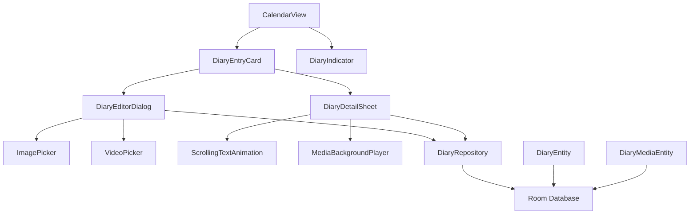

# 日历日记功能技术设计

Feature Name: calendar-diary-feature
Updated: 2026-06-04

## Description

为 MemoriaBox 应用的日历视图添加完整的日记功能，支持文字记录、图片/视频附件、滚动文字动画展示和媒体背景效果。

## Architecture



## Components and Interfaces

### 1. 数据层

#### DiaryEntity (数据模型)
```kotlin
@Entity(tableName = "diary_entries")
data class DiaryEntity(
    @PrimaryKey(autoGenerate = true) val id: Long = 0,
    val date: String, // ISO 格式：yyyy-MM-dd
    val content: String,
    val hasImage: Boolean = false,
    val hasVideo: Boolean = false,
    val backgroundMediaUri: String? = null,
    val backgroundMediaType: MediaType? = null,
    val createdAt: Long = System.currentTimeMillis(),
    val updatedAt: Long = System.currentTimeMillis()
)

enum class MediaType { IMAGE, VIDEO }
```

#### DiaryMediaEntity (媒体附件)
```kotlin
@Entity(tableName = "diary_media")
data class DiaryMediaEntity(
    @PrimaryKey(autoGenerate = true) val id: Long = 0,
    val diaryId: Long,
    val mediaUri: String,
    val mediaType: MediaType,
    val thumbnailUri: String? = null,
    val order: Int = 0
)
```

#### DiaryDao
```kotlin
@Dao
interface DiaryDao {
    @Query("SELECT * FROM diary_entries WHERE date = :date")
    fun getDiaryByDate(date: String): Flow<DiaryEntity?>
    
    @Query("SELECT DISTINCT date FROM diary_entries WHERE date LIKE :prefix")
    fun getDiaryDatesInMonth(prefix: String): Flow<List<String>>
    
    @Insert(onConflict = OnConflictStrategy.REPLACE)
    suspend fun upsertDiary(diary: DiaryEntity)
    
    @Delete
    suspend fun deleteDiary(diary: DiaryEntity)
    
    @Query("SELECT * FROM diary_media WHERE diaryId = :diaryId ORDER BY `order`")
    fun getMediaForDiary(diaryId: Long): Flow<List<DiaryMediaEntity>>
}
```

### 2. UI 层

#### CalendarView 增强
- 在现有 `CalendarView.kt` 中添加日记指示器
- 每个日期格子下方显示小图标标记日记状态
- 点击日期时检查是否存在日记，存在则展示详情，否则弹出编辑框

#### DiaryEditorDialog
- 全屏或底部弹窗形式的编辑器
- 包含：
  - 多行文本输入框
  - 图片添加按钮（调用系统相册/相机）
  - 视频添加按钮
  - 背景媒体选择按钮
  - 保存/取消按钮

#### DiaryDetailSheet
- 底部弹窗或全屏展示
- 核心组件：
  - `ScrollingTextAnimation` - 滚动文字动画组件
  - `MediaBackgroundPlayer` - 背景媒体播放器
  - 图片/视频附件展示区域

#### ScrollingTextAnimation
```kotlin
@Composable
fun ScrollingTextAnimation(
    text: String,
    charDelay: Long = 80L,
    onComplete: () -> Unit = {},
    modifier: Modifier = Modifier
) {
    // 使用 AnimatedContent 或自定义动画
    // 逐字显示文本
}
```

#### MediaBackgroundPlayer
```kotlin
@Composable
fun MediaBackgroundPlayer(
    mediaUri: String,
    mediaType: MediaType,
    modifier: Modifier = Modifier
) {
    // IMAGE: 使用 AsyncImage 加载
    // VIDEO: 使用 ExoPlayer 循环播放（静音）
    // 添加半透明遮罩层
}
```

### 3. 业务逻辑层

#### DiaryRepository
```kotlin
class DiaryRepository(
    private val diaryDao: DiaryDao,
    private val context: Context
) {
    fun getDiaryByDate(date: String) = diaryDao.getDiaryByDate(date)
    
    fun getDiaryDatesInMonth(yearMonth: YearMonth) = 
        diaryDao.getDiaryDatesInMonth("${yearMonth.year}-${yearMonth.month.value}")
    
    suspend fun saveDiary(diary: DiaryEntity, mediaList: List<DiaryMediaEntity>) {
        // 保存日记和关联的媒体文件
    }
    
    suspend fun deleteDiary(diary: DiaryEntity) {
        // 删除日记及其媒体文件
    }
}
```

#### DiaryViewModel
```kotlin
class DiaryViewModel(
    private val repository: DiaryRepository
) : ViewModel() {
    private val _selectedDate = MutableStateFlow<String?>(null)
    val selectedDate: StateFlow<String?> = _selectedDate
    
    private val _editingDiary = MutableStateFlow<DiaryEntity?>(null)
    val editingDiary: StateFlow<DiaryEntity?> = _editingDiary
    
    fun selectDate(date: String) {
        _selectedDate.value = date
    }
    
    fun startEditing(date: String, existingDiary: DiaryEntity? = null) {
        _editingDiary.value = existingDiary ?: DiaryEntity(date = date)
    }
    
    fun saveDiary(content: String, mediaList: List<DiaryMediaEntity>) {
        viewModelScope.launch {
            // 保存逻辑
        }
    }
}
```

## Data Models

### 数据库表结构

#### diary_entries 表
| 字段 | 类型 | 约束 | 说明 |
|------|------|------|------|
| id | INTEGER | PRIMARY KEY AUTOINCREMENT | 日记ID |
| date | TEXT | NOT NULL, UNIQUE | 日期 (yyyy-MM-dd) |
| content | TEXT | NOT NULL | 日记内容 |
| hasImage | INTEGER | DEFAULT 0 | 是否包含图片 |
| hasVideo | INTEGER | DEFAULT 0 | 是否包含视频 |
| backgroundMediaUri | TEXT | NULLABLE | 背景媒体URI |
| backgroundMediaType | TEXT | NULLABLE | 背景媒体类型 |
| createdAt | INTEGER | NOT NULL | 创建时间戳 |
| updatedAt | INTEGER | NOT NULL | 更新时间戳 |

#### diary_media 表
| 字段 | 类型 | 约束 | 说明 |
|------|------|------|------|
| id | INTEGER | PRIMARY KEY AUTOINCREMENT | 媒体ID |
| diaryId | INTEGER | NOT NULL, FK | 关联日记ID |
| mediaUri | TEXT | NOT NULL | 媒体文件URI |
| mediaType | TEXT | NOT NULL | IMAGE/VIDEO |
| thumbnailUri | TEXT | NULLABLE | 缩略图URI |
| order | INTEGER | DEFAULT 0 | 显示顺序 |

### 实体关系
```
DiaryEntry (1) ──< DiaryMedia (N)
```

## Correctness Properties

1. **日期唯一性**: 每个日期只能有一个日记条目
2. **媒体关联完整性**: 删除日记时必须级联删除关联的媒体记录
3. **URI 权限持久化**: 媒体文件 URI 需要持久化授权，确保应用重启后仍可访问
4. **动画流畅性**: 文字动画必须在主线程执行，避免卡顿
5. **背景视频性能**: 视频背景必须静音且循环播放，避免音频冲突

## Error Handling

### 错误场景与处理策略

| 错误场景 | 处理策略 |
|----------|----------|
| 媒体文件加载失败 | 显示占位符，回退到纯色背景 |
| 相机/相册权限拒绝 | 提示用户授予权限，提供设置跳转 |
| 存储空间不足 | 提示用户清理空间，禁止添加新媒体 |
| 视频格式不支持 | 提示格式错误，建议选择其他视频 |
| 数据库写入失败 | 显示保存失败提示，保留编辑内容 |
| 动画过程中用户离开 | 取消动画，释放资源 |

### 权限请求
```kotlin
// AndroidManifest.xml 需要添加
<uses-permission android:name="android.permission.CAMERA" />
<uses-permission android:name="android.permission.READ_EXTERNAL_STORAGE" />
<uses-permission android:name="android.permission.READ_MEDIA_IMAGES" />
<uses-permission android:name="android.permission.READ_MEDIA_VIDEO" />
```

## Test Strategy

### 单元测试
- DiaryRepository 测试：CRUD 操作、日期查询
- DiaryViewModel 测试：状态管理、日期选择、保存逻辑
- ScrollingTextAnimation 测试：字符延迟计算、动画完成回调

### UI 测试
- 日历视图日记标记渲染测试
- 日记编辑器输入和保存测试
- 滚动文字动画流畅性测试
- 背景媒体加载和播放测试

### 集成测试
- 日记保存后数据库查询验证
- 图片/视频添加后 URI 权限验证
- 删除日记级联删除验证

### 手动测试清单
- [ ] 创建纯文字日记并验证展示
- [ ] 添加图片到日记并验证缩略图
- [ ] 添加视频到日记并验证播放
- [ ] 设置照片背景并验证遮罩效果
- [ ] 设置视频背景并验证循环播放
- [ ] 滚动文字动画跳过功能
- [ ] 日历视图日记标记正确性
- [ ] 权限拒绝后的用户体验

## References

[^1]: (Jetpack Compose Animation) - [Compose Animation 文档](https://developer.android.com/jetpack/compose/animation)
[^2]: (Room Database) - [Room 持久化库](https://developer.android.com/training/data-storage/room)
[^3]: (ExoPlayer) - [ExoPlayer 视频播放](https://exoplayer.dev/)
[^4]: (Coil Image Loading) - [Coil 图片加载](https://coil-kt.github.io/coil/)
