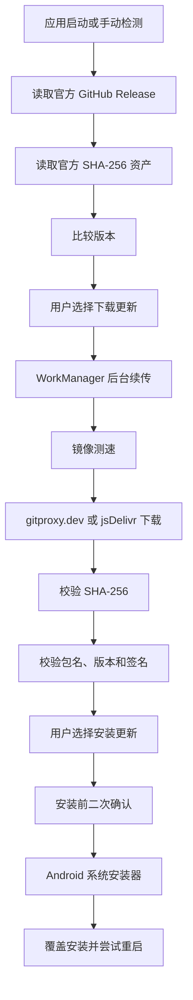

# GitHub 在线更新技术设计

Feature Name: github-online-update
Updated: 2026-08-10

## Description

客户端从官方 GitHub Release API 获取版本和更新说明，从官方 Release 校验资产获得 SHA-256。检测到新版本后等待用户选择，用户点击“下载更新”后创建 WorkManager 后台工作。后台工作以 `.part` 文件续传，在 gitproxy.dev、cdn.jsdelivr.net 和官方 Release URL 间测速并选取首个有效候选。校验通过的 APK 移入系统 Download 文件夹；覆盖安装完成广播删除公开安装包和内部临时 APK。

## Architecture



## Components and Interfaces

### UpdateManager

- 持有全局 `StateFlow<UpdateState>`。
- 请求 GitHub Release API 和 SHA-256 资产。
- 比较语义版本并管理自动检测时间。
- 在用户确认下载后创建唯一 WorkManager 工作、镜像测速和安装包验证。
- 对 UI 暴露检测、重试、忽略和安装操作。

### UpdateVerifier

- 解析 `.sha256` 文本。
- 计算文件 SHA-256。
- 使用 `PackageManager` 读取 APK 包名、版本和签名证书。
- 将下载 APK 与当前安装包签名进行比较。

### ApkInstaller

- 检查 `canRequestPackageInstalls()`。
- 创建公开 Download MediaStore URI。
- 打开系统安装器。

### PackageReplacedReceiver

- 接收 `MY_PACKAGE_REPLACED`。
- 尝试启动主界面。
- 创建“更新完成，点击打开”通知作为后台启动受限时的回退。

### Compose 更新界面

- 主界面启动时触发自动检测。
- 新版本弹窗展示版本、Release Notes、“下载更新”和“稍后”操作。
- 下载中的弹窗展示“后台下载”，操作后关闭弹窗且通知继续展示进度。
- 下载完成后展示“安装更新”和“稍后”操作。
- 设置页增加“版本检测”按钮和当前状态摘要。
- 安装前展示二次确认弹窗。

## Data Models

```text
UpdateInfo
  versionName: String
  releaseName: String
  releaseNotes: String
  publishedAt: String
  apkName: String
  apkUrl: String
  apkSize: Long
  sha256: String

UpdateState
  Idle
  Checking
  Available(UpdateInfo)
  Downloading(UpdateInfo, progress)
  Ready(UpdateInfo, apkPath)
  UpToDate
  Error(message, UpdateInfo?)
```

## Correctness Properties

- 只有 SHA-256、包名、版本和签名全部通过的 APK 才能进入安装步骤。
- 镜像地址不提供版本信息和信任信息。
- APK `versionCode` 必须大于当前 `BuildConfig.VERSION_CODE`。
- APK `versionName` 必须与 GitHub Release 标签规范化后的版本一致。
- APK 签名证书摘要集合必须与当前安装应用签名证书摘要集合一致。
- 相同版本名称和版本码的 Release 进入“已是最新版本”状态。
- 下载任务取消或进程重建后保留 `.part` 文件，并从已有字节位置发起 Range 请求。

## Error Handling

- GitHub API 不可用：显示检测失败，保留手动重试。
- SHA-256 资产缺失：阻止自动更新并提示发布资产不完整。
- 所有镜像测速失败：保留 `.part` 文件并显示可重试错误。
- 校验失败：清除不可安装结果并显示具体校验阶段。
- 安装来源权限缺失：打开系统授权页，返回后继续安装。
- 系统限制自动重启：通过更新完成通知提供启动入口。

## Test Strategy

- 单元测试语义版本比较。
- 单元测试 SHA-256 文本解析和文件摘要。
- 单元测试镜像 URL 生成。
- 构建 Release APK 后生成 `.sha256` 并执行 `apksigner verify`。
- 从 GitHub Release 下载 APK 后再次执行 SHA-256 和签名验证。

## References

- GitHub Releases API: https://docs.github.com/en/rest/releases/releases
- Android PackageManager: https://developer.android.com/reference/android/content/pm/PackageManager
- Android FileProvider: https://developer.android.com/reference/androidx/core/content/FileProvider
