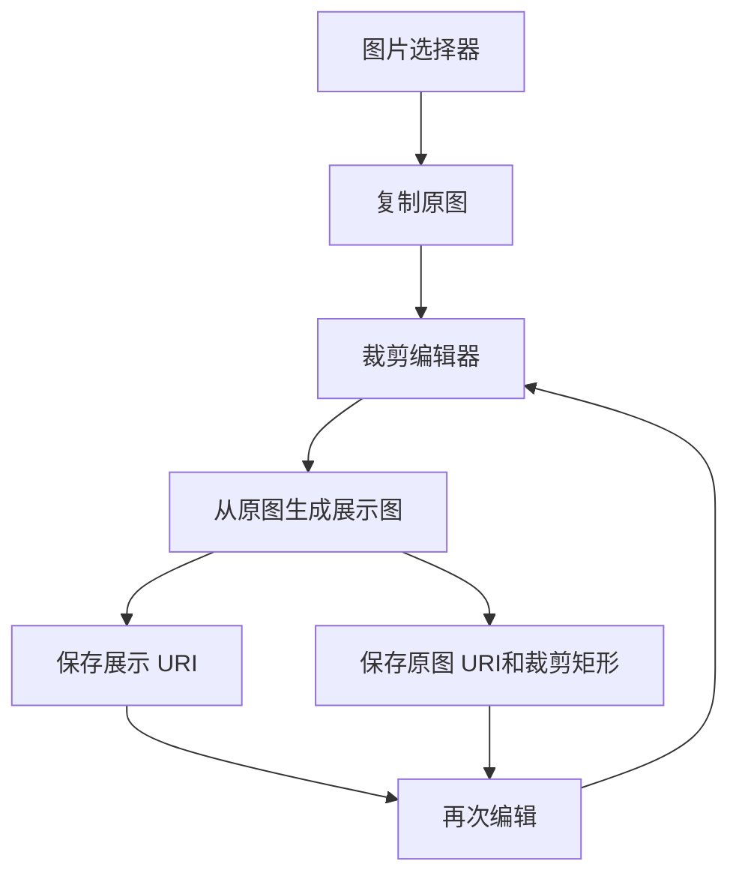

# 原图重复裁剪设计

Feature Name: original-image-recrop
Updated: 2026-08-28

## 描述

通过应用私有存储保留原图，并在编辑状态中记录原图 URI 与裁剪参数。展示 URI 继续作为现有业务数据的值，避免修改 Room 实体结构；编辑元数据使用独立持久化存储按展示 URI 索引。

裁剪交互为所见即所得（WYSIWYG）：图片在裁剪画布上可拖动取景、双指缩放；白色裁剪框（固定比例）可整体拖动或拖动四角缩放。保存的源图矩形区域与预览完全一致。

## 架构

## 组件与接口

- `ImageImportUtils`：复制原图、从原图生成展示图、读取和保存编辑元数据。
- `EventImageCropDialog`：接收初始原图 URI、裁剪比例与恢复状态（`EditState?`），回调 `(sourceLeft, sourceTop, sourceWidth, sourceHeight)` 归一化矩形。
- `CustomizationSettingsScreen`：处理页面背景和底部图标四个入口。
- `BoxDialog`：处理分类图标入口。
- `EventDialog`：处理事件卡片背景入口。

## 数据模型

编辑元数据包含：

- `sourceUri`：应用私有存储中的原图 URI。
- `cropLeft`、`cropTop`、`cropWidth`、`cropHeight`：原图上的归一化裁剪矩形（范围 0..1）。

元数据以展示 URI 的稳定键保存。旧展示图没有元数据时，`sourceUri` 回退为展示 URI，矩形回退为全图（`0, 0, 1, 1`）。

## 裁剪一致性

- 裁剪画布内，图片以 `fitScale * zoom` 呈现，`fitScale` 由画布尺寸与原图尺寸决定。
- 裁剪框左上角在图片坐标系中的归一化位置为 `(frame.left - imageLeft) / (scalePx * imageWidth)`，宽高同理；保存时直接以此计算源图矩形。
- `decodeWithOrientation()` 使用 `android.media.ExifInterface`（minSdk 24 可用）读取 EXIF 方向并旋转原图，保证预览与保存使用同一坐标系。
- 恢复时根据 `EditState` 反算缩放与平移，使上次的裁剪框位置在预览中重现。

## 正确性约束

1. 每次保存展示图都从 `sourceUri` 解码原图，并按归一化矩形裁切。
2. 展示图更新后，元数据索引同步指向新的展示 URI。
3. 旧图片数据缺少元数据时仍可展示和再次保存。
4. 四类入口使用各自的裁剪比例。

## 错误处理

- 原图复制失败时回退到选择器 URI，并沿用现有展示逻辑。
- 原图解码或裁剪失败时回退到原图副本。
- 元数据损坏时忽略元数据并以展示图作为编辑源。

## 测试策略

- 验证原图复制、展示图生成和元数据读写。
- 验证重复保存始终从原图生成结果。
- 验证缺少元数据的旧图片可以继续编辑。
- 使用 `compileReleaseKotlin` 和 Release APK 构建验证集成代码。
