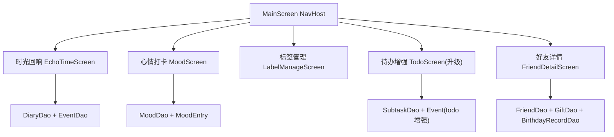

# v3.7.0 下一版本功能技术设计

Feature Name: v3.7.0-next-features
Updated: 2026-08-10

## Description

v3.7.0 新增五个功能模块，全部复用现有 Room 数据层与应用风格，数据库从版本 7 迁移到版本 8。

## Architecture



## Components and Interfaces

### 数据层（数据库 v7 -> v8）

新增实体与迁移：

```text
MoodEntry
  id: String
  date: Long          # 按天，唯一
  level: Int          # 1..5
  activity: String    # 活动标签（JSON 数组字符串）
  note: String
  createdAt: Long

TodoSubtask
  id: String
  todoId: String      # 关联 Event.id
  title: String
  done: Boolean
  sortOrder: Int

FriendGift
  id: String
  friendId: String
  name: String
  price: Double
  status: String      # PLANNED / PURCHASED / GIVEN
  year: Int
  createdAt: Long

FriendBirthdayRecord
  id: String
  friendId: String
  year: Int
  note: String
  createdAt: Long
```

`Event` 表新增列（迁移 ADD COLUMN）：

- `todo_priority TEXT NOT NULL DEFAULT 'MEDIUM'`（HIGH/MEDIUM/LOW）
- `todo_subtasks_json TEXT`（可选：冗余存储子任务，便于备份兼容）

新增 DAO：`MoodDao`、`SubtaskDao`、`GiftDao`、`BirthdayRecordDao`。

### Repository

- `MoodRepository`：心情 CRUD、月度统计查询。
- `SubtaskRepository`：子任务 CRUD。
- `GiftRepository`：礼物 CRUD。
- `BirthdayRecordRepository`：历年记录 CRUD。
- `FriendRepository`：扩展关系读写。

### 页面

| 页面 | 文件 | 入口 |
|------|------|------|
| 时光回响 | `ui/screen/EchoTimeScreen.kt` | 首页 Hero 卡片 |
| 心情打卡 | `ui/screen/MoodScreen.kt` | 日历页入口 + 底部弹窗 |
| 标签管理 | `ui/screen/LabelManageScreen.kt` | 设置页 |
| 待办增强 | `ui/screen/components/BoxList.kt` + 新增对话框 | 待办页 |
| 好友详情 | `ui/screen/FriendDetailScreen.kt` | 好友列表点击 |

### 导航

`Navigation.kt` 新增 route：`EchoTime`、`Mood`、`Labels`、`FriendDetail/{friendId}`。

## Data Models

数据库版本 7 -> 8 迁移策略：

```kotlin
MIGRATION_7_8 = object : Migration(7, 8) {
    override fun migrate(db) {
        ensureColumnExists(db, "events", "todo_priority", "TEXT NOT NULL DEFAULT 'MEDIUM'")
        db.execSQL(CREATE TABLE IF NOT EXISTS mood_entries (...))
        db.execSQL(CREATE TABLE IF NOT EXISTS todo_subtasks (...))
        db.execSQL(CREATE TABLE IF NOT EXISTS friend_gifts (...))
        db.execSQL(CREATE TABLE IF NOT EXISTS friend_birthday_records (...))
    }
}
```

`repairLegacyData` 追加 `todo_priority` 与新增表的建表逻辑，保证旧库直开不迁移时也可用。

## Correctness Properties

- 心情等级恒在 1..5 之间。
- 子任务 `todoId` 必须指向存在的待办事件。
- 礼物 `friendId` 必须指向存在的 friend。
- 待办逾期判定：`todoStatus == PENDING && dueDate != null && dueDate < now`。
- 自动生日事件：好友有生日但无对应生日事件时补建 `Event(type=BIRTHDAY, is_birthday=true, repeat_yearly=true)`。

## Error Handling

- 心情重复日期：按 `date` upsert。
- 删除好友：级联删除关系、礼物、历年记录；保留自动生日事件不影响好友。
- 子任务全部完成：父待办保持独立状态，仅展示提示。
- 备份兼容：`BackupManager` 备份清单扩展新增表。

## Test Strategy

- 单元测试心情等级边界、逾期判定、生日事件生成逻辑。
- Room 迁移测试 v7->v8。
- `assembleDebug` 构建验证。

## References

- Room Migration: https://developer.android.com/training/data-storage/room/migrating-db-versions
- 现有数据库: `app/src/main/java/com/memoriabox/database/AppDatabase.kt`
