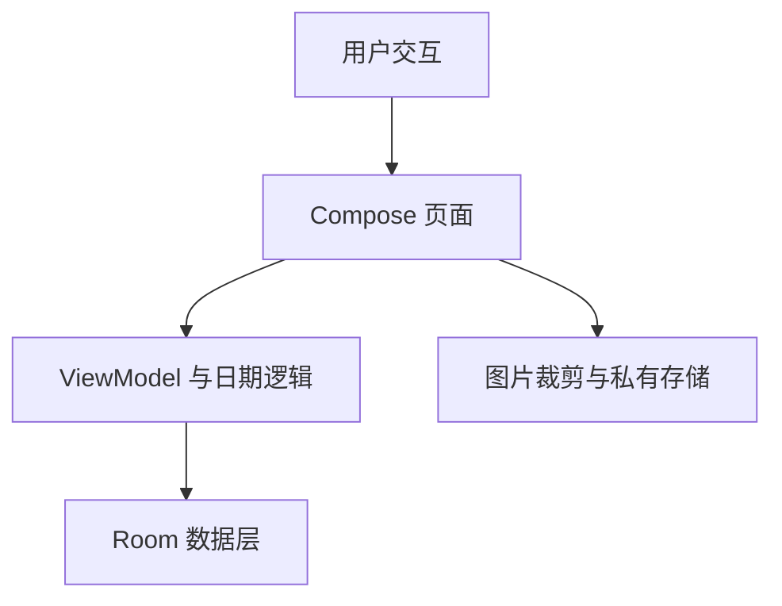

# Calendar, Friends and Card UX

Feature Name: calendar-friends-and-card-ux
Updated: 2026-08-18

## Description

本设计覆盖卡片背景裁剪预览、设置入口整理、好友生日录入、年度周期计算、日历月份滑动和分类创建简化。

## Architecture

背景裁剪继续使用现有私有存储流程，裁剪窗口根据卡片模板比例传入目标宽高比。好友日期沿用毫秒时间戳存储，空年份通过年度周期计算处理。日历月份状态由日历页面持有，左右滑动更新月份。

## Components and Interfaces

- `BoxEventDialogs.kt`：根据模板计算裁剪预览比例，显示裁剪区域尺寸。
- `FriendsScreen.kt`：提供月份、日期必填和年份可选的生日编辑器。
- `ViewModels.kt`：统一好友下一生日距离计算。
- `EventComponents.kt`：为日历卡片添加左右月份手势。
- `SettingsScreen.kt`、`MainScreen.kt`：移除工具箱专属入口与路由。
- `BoxEventDialogs.kt`：新增分类表单只显示名称字段。

## Data Models

现有 `Friend.birthdayDate` 继续保存日期时间戳。年份为空时保存一个用于月份和日期计算的基准日期，展示与排序逻辑忽略基准年份；指定年份保留原始日期信息。

## Correctness Properties

- 裁剪预览比例与最终卡片显示比例一致。
- 更新后的生日距离始终落在下一次实际生日周期内。
- 日历向左和向右滑动分别只改变一个月份。
- 分类创建不会覆盖已有分类的图标、背景和颜色字段。
- 工具箱移除不会删除其他页面仍使用的业务代码。

## Error Handling

- 图片无法读取时保留原背景并提示选择失败。
- 好友名称、月份或日期缺失时阻止保存。
- 日期计算遇到无效日期时回退到系统日期选择器的合法值。

## Test Strategy

- 日期逻辑覆盖普通年份、闰年、生日当天和生日次日。
- UI 验证裁剪比例、月份滑动和分类字段可见性。
- 回归验证设置、首页、日历、好友及标签功能。
