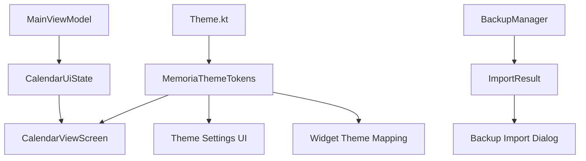

# Calendar Theme UX Upgrade Design

## Overview

本设计将日历和主题升级拆成四条主线：日历视觉系统、主题语义 token、设置页主题选择体验、备份导入确认体验。实现时优先复用现有 Compose、Material 3、Room、ViewModel 和 `AdaptiveUi` 能力，避免重写数据层。

设计目标：

- 让 `CalendarViewScreen` 从固定渐变迁移到主题驱动视觉。
- 为日期状态建立统一模型，覆盖今天、选中、有日记、有纪念日、节日和待办。
- 补齐中文排版层级和主题预览，提升设置页可理解性。
- 保留底部导航中间随机颜文字和 MemoriaBox 的温柔手账气质。
- 强化备份导入前确认和导入后结果反馈。

## Architecture



## Current Code Touchpoints

- `app/src/main/java/com/memoriabox/ui/screen/components/EventComponents.kt`
  - `CalendarViewScreen` 位于此文件，是日历升级主入口。
  - 日期格、月份切换、日记小蓝点和农历展示应在这里统一样式。
- `app/src/main/java/com/memoriabox/ui/theme/Theme.kt`
  - 当前已有多个 `AppThemeMode` 和 `MaterialTheme.colorScheme`。
  - 新增语义 token 应与现有主题模式绑定。
- `app/src/main/java/com/memoriabox/ui/theme/Type.kt`
  - 当前 Typography 层级较少，应补齐中文标题、正文、标签和辅助信息。
- `app/src/main/java/com/memoriabox/ui/utils/AdaptiveUi.kt`
  - 已提供 `rememberAdaptiveUiSize()`，日历密集布局应继续使用它。
- `app/src/main/java/com/memoriabox/ui/screen/components/SettingsComponents.kt`
  - 主题分组、主题预览墙、备份密码输入和导入确认都可在此扩展。
- `app/src/main/java/com/memoriabox/ui/screen/MainScreen.kt`
  - 保留底部导航中间随机颜文字逻辑。
  - 备份导入/导出入口会调用更新后的确认流程。
- `app/src/main/java/com/memoriabox/utils/BackupManager.kt`
  - 已采用合并导入方向，后续返回结构化导入结果。

## Data Models

### Theme Tokens

新增轻量语义 token，建议放在 `Theme.kt` 或新文件 `MemoriaThemeTokens.kt`。

```kotlin
@Immutable
data class MemoriaThemeTokens(
    val calendarBackground: Color,
    val calendarCard: Color,
    val calendarToday: Color,
    val calendarSelected: Color,
    val calendarSelectedContent: Color,
    val diaryMarker: Color,
    val anniversaryMarker: Color,
    val festivalMarker: Color,
    val todoMarker: Color,
    val heatLow: Color,
    val heatHigh: Color,
    val gentleWarning: Color,
    val success: Color
)
```

提供 `LocalMemoriaThemeTokens`：

```kotlin
val LocalMemoriaThemeTokens = staticCompositionLocalOf { defaultMemoriaThemeTokens() }
```

`MemoriaBoxTheme` 根据 `AppThemeMode` 提供 token：

```kotlin
CompositionLocalProvider(LocalMemoriaThemeTokens provides tokens) {
    MaterialTheme(colorScheme = colorScheme, typography = Typography, content = content)
}
```

### Calendar Day State

```kotlin
data class CalendarDayUiState(
    val date: LocalDate,
    val isCurrentMonth: Boolean,
    val isToday: Boolean,
    val isSelected: Boolean,
    val lunarText: String?,
    val diaryCount: Int,
    val anniversaryCount: Int,
    val festivalName: String?,
    val todoCount: Int,
    val heatLevel: Int
)
```

### Selected Day Summary

```kotlin
data class SelectedDaySummaryUiState(
    val date: LocalDate,
    val title: String,
    val diaryCount: Int,
    val nearestDiaryPreview: String?,
    val anniversaries: List<AnniversarySummary>,
    val todos: List<TodoSummary>,
    val emptyStateText: String
)
```

### Import Result

```kotlin
data class ImportResult(
    val importedDays: Int,
    val updatedDays: Int,
    val importedLogs: Int,
    val importedMedia: Int,
    val skippedItems: Int,
    val failedItems: Int,
    val message: String
)
```

## Components

### ThemedCalendarSurface

负责日历外层背景、月份头、视图切换和主题化容器。

职责：

- 使用 `LocalMemoriaThemeTokens.current.calendarBackground` 和 `calendarCard`。
- 根据 `AdaptiveUiSize` 控制间距、圆角和标题大小。
- 暴露 `CalendarDisplayMode.Month`、`Week`、`Agenda`。

### CalendarDayCell

负责单个日期格。

状态优先级：

1. 选中日期。
2. 今天。
3. 有内容日期。
4. 当前月普通日期。
5. 非当前月日期。

实现细节：

- 日期数字为主要信息。
- 农历和节日为辅助信息，紧凑布局可截断。
- 标记最多显示 3 个点，超过时显示聚合点。
- 标记颜色来自 `diaryMarker`、`anniversaryMarker`、`festivalMarker`、`todoMarker`。

### SelectedDaySummaryCard

负责选中日期下方摘要。

显示顺序：

1. 日期和农历。
2. 纪念日倒数或已过天数。
3. 日记数量与最近摘要。
4. 待办概览。
5. 空状态和创建入口。

### ThemePreviewCard

负责主题设置页预览墙。

内容：

- 迷你日历 3 到 5 个日期格。
- 一个选中日期。
- 至少两个内容标记。
- 一张摘要卡片色块。

### BackupImportConfirmDialog

负责导入前确认。

内容：

- 明确展示“合并导入，保留当前数据”。
- 密码输入使用隐藏显示。
- 风险说明采用普通提示样式，避免恐吓式文案。
- 确认后调用导入流程。

### BackupImportResultDialog

负责导入后摘要。

内容：

- 新增、更新、跳过、失败数量。
- 成功和失败分别使用 token 色。
- 失败时展示可理解错误。

## Interaction Design

### Calendar Navigation

- 月份标题点击打开年月选择。
- “今天”按钮回到今天并选中当天。
- 月视图保留当前月份网格。
- 周视图显示 7 天并同步摘要区。
- 议程视图按日期分组显示近期内容。

### Theme Selection

- 主题分组：推荐、护眼、个性、暗色。
- 默认推荐突出 `WARM`、`CREAM`、`MINT`、`LAVENDER`。
- 当前主题显示选中 ring 和文字提示。
- 主题预览卡点击即应用，保持现有设置保存逻辑。

### Backup Import

- 用户选择备份文件后先显示确认弹窗。
- 用户输入密码后开始导入。
- 导入完成后显示结构化摘要。
- 导入失败时保留当前数据并显示错误原因。

## Accessibility

- 所有日期格需要有语义描述：日期、是否今天、是否选中、日记数量、纪念日数量。
- 标记颜色不能作为唯一信息来源，摘要区或图例需要解释含义。
- 文本对比度目标为 WCAG AA。
- 日期格点击目标建议不低于 44dp。
- compact 布局下优先保留日期数字和选中态，辅助文字可减少。

## Implementation Notes

- 优先小步改造，先落地主题统一、日期选中态和摘要区。
- `MainScreen.kt` 体量较大，修改底部导航时必须只做必要改动，保留随机颜文字。
- 不在日历组件中新增固定红紫蓝渐变。
- 新增待办、故事卡片和小组件同步属于后续扩展，可先完成规格和 UI 容器。
- 备份导入当前已具备合并导入基础，后续重点是结果结构化和用户确认。

## Testing Strategy

### Unit and ViewModel Tests

- 日期状态优先级：今天、选中、有内容、非当前月。
- 标记聚合逻辑：0、1、2、3、超过 3 类内容。
- 导入结果统计：新增、更新、跳过、失败。

### Compose UI Checks

- 每个主题下日历页可读。
- compact 和 roomy 布局下日期格无明显溢出。
- 字体放大时摘要区和按钮仍可操作。
- 主题预览卡能展示选中态和标记。

### Manual Verification

- 切换所有 `AppThemeMode` 后查看日历、主题设置和备份弹窗。
- 导入有密码备份和无密码备份。
- 验证底部导航中间项仍显示随机颜文字。
- 构建命令：

```bash
# Compile debug Kotlin sources
export JAVA_HOME=/usr/lib/jvm/java-17-openjdk-amd64 ANDROID_HOME=/usr/lib/android-sdk && /tmp/gradle-8.7/bin/gradle :app:compileDebugKotlin --no-daemon

# Assemble debug APK
export JAVA_HOME=/usr/lib/jvm/java-17-openjdk-amd64 ANDROID_HOME=/usr/lib/android-sdk && /tmp/gradle-8.7/bin/gradle :app:assembleDebug --no-daemon
```

## Migration Plan

1. 新增 theme token，不改变现有主题枚举。
2. 日历组件改为读取 token。
3. 引入日期状态模型和摘要卡片。
4. 设置页新增主题分组和预览墙。
5. 备份导入增加确认与结果摘要。
6. 后续扩展周视图、议程视图、热力图、故事卡片、待办和小组件同步。
