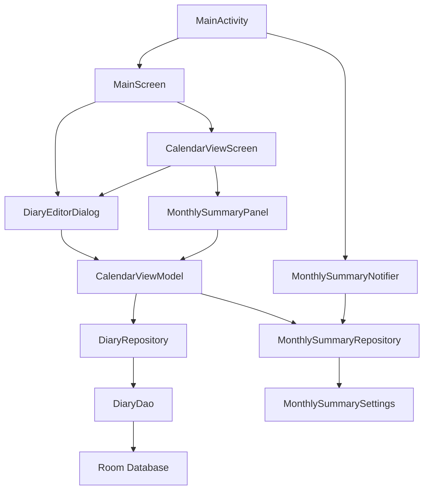

# 日历日记与月度总结技术设计

Feature Name: monthly-diary-calendar-summary
Updated: 2026-06-05

## Description

该功能分两部分实现：第一部分完善日记日期管理和日历日记标记，确保用户从日历和日记入口创建日记时具备日期默认值、日期选择、日期展示和日历小蓝点反馈；第二部分新增月度视觉记录与日记总结模块，支持按月聚合照片、展示文字总结、播放模式、速度调节、全局开关和每月 1 号首次打开提醒。

## Architecture



日记日期管理复用当前 `DiaryEntry.dateStart` 字段，新增编辑页内日期状态和日期选择器。月度总结以现有 `DiaryEntry` 和 `DiaryMedia` 为数据源，按月份查询并转换为 UI 模型。每月 1 号首次打开提醒由 `MainActivity` 或应用启动层触发检查，使用设置项记录已提醒月份。月度日记总结使用本地规则摘要，每月 1 号提醒同时支持系统通知栏和应用内弹窗，月度视觉记录仅使用日记媒体照片。

## Confirmed Decisions

- 月度日记总结使用本地规则摘要，首版不接入网络 AI 能力。
- 每月 1 号提醒同时支持系统通知栏和应用内弹窗。
- 月度视觉记录仅使用 `DiaryMedia.mediaType == IMAGE` 的日记媒体照片。
- 照片墙模块 `PhotoWallScreen` 的图片不进入月度视觉记录。
- 首版不生成语音文件，播放速度控制视觉轮播和文字同步展示。
- 当前项目为 Android Jetpack Compose 应用，日历交互基于现有 Compose 日历网格和 `DatePickerDialog` 扩展。

## Existing Code Impact Analysis

- `DiaryEntry.dateStart` 已用于日记归属日期，新增日期编辑能力应继续复用该字段。
- `CalendarViewScreen` 已使用 `diaries.groupBy { it.dateStart }` 聚合日记，小蓝点应继续由该聚合结果驱动。
- `CalendarViewModel.saveDiaryWithMedia(existingDiary, date, content, mediaItems, backgroundUri)` 已支持编辑旧日记和新增日记，应扩展为接收编辑页最终日期。
- `DiaryMedia.aspectRatio` 已存在，可用于月度视觉记录照片展示比例。
- `AppSettings` 已保存日记滚动动画开关和速度，月度总结开关与播放速度适合继续放在同一设置工具中。
- `NotificationHelper` 和 `ReminderReceiver` 已负责本地通知，月度总结通知应复用通知渠道或新增独立 channel。
- `PhotoWallScreen` 当前作为独立照片墙页面，月度视觉记录按用户决策不读取该模块图片。
- 当前代码已允许同一天多篇日记，设计应保持多篇能力，蓝点按日期去重判断。
- 当前代码的 `DiaryEditorDialog` 已有媒体编辑能力，日期选择需要与未保存内容保护一起实现。
- 当前项目没有 Web 前端依赖，FullCalendar、react-calendar 等 Web 库不适用。

## Components and Interfaces

### DiaryEditorDialog

当前文件：`app/src/main/java/com/memoriabox/ui/screen/components/DiaryComponents.kt`

职责：
- 接收初始日期 `dateStart`。
- 显示年月日格式日期。
- 提供日期选择器。
- 保存时回传用户选择后的日期。
- 编辑已有日记时使用已有日记日期作为初始日期。

交互要求：
- 日期文本放在顶部左侧或中部，仅用于展示。
- 右上角放置日历图标按钮，用于打开日期选择器。
- 日期选择器打开时高亮当前编辑日记日期。
- 用户选择已有日记日期时，展示该日期日记列表，并允许加载某篇日记或保留当前内容继续新建。
- 当前内容有未保存改动时，切换日期前展示确认对话框。

建议接口调整：

```kotlin
fun DiaryEditorDialog(
    existingDiary: DiaryEntry? = null,
    existingMedia: List<DiaryMedia> = emptyList(),
    dateStart: Long,
    onDismiss: () -> Unit,
    onSave: (dateStart: Long, content: String, media: List<DiaryMedia>, backgroundUri: String?) -> Unit,
    onDateChanged: (dateStart: Long) -> Unit = {},
    onRequestDiariesForDate: (dateStart: Long) -> List<DiaryEntry> = { emptyList() },
    onDelete: () -> Unit = {}
)
```

### CalendarViewScreen

当前文件：`app/src/main/java/com/memoriabox/ui/screen/components/EventComponents.kt`

职责：
- 继续展示事件和日记标记。
- 对存在日记的日期显示小蓝点。
- 在右侧新增月份下拉选择按钮。
- 在月份选择按钮下方显示总结日记模块入口。
- 打开 `MonthlySummaryPanel` 或同级弹层。

布局要求：
- 在宽屏上，将月份下拉和总结入口放到日历视图右侧。
- 在小屏上，将右侧控件折叠为悬浮按钮或底部半透明面板。
- 控件使用半透明背景，避免遮挡背景图关键区域。

建议新增状态：

```kotlin
var selectedSummaryMonth by remember { mutableStateOf(currentMonthStart) }
var showMonthlySummary by remember { mutableStateOf(false) }
```

### CalendarViewModel

当前文件：`app/src/main/java/com/memoriabox/viewmodel/ViewModels.kt`

职责：
- 保存日记时使用编辑页返回的日期。
- 按月份聚合日记和媒体。
- 暴露月度总结 UI 状态。

建议新增方法：

```kotlin
fun saveDiaryWithMedia(
    existingDiary: DiaryEntry?,
    dateStart: Long,
    content: String,
    mediaItems: List<DiaryMedia>,
    backgroundUri: String?
)

fun loadMonthlySummary(monthStart: Long)
```

### MonthlySummaryPanel

建议新增文件：`app/src/main/java/com/memoriabox/ui/screen/components/MonthlySummaryComponents.kt`

职责：
- 显示月度视觉时间轴。
- 显示文字总结。
- 提供播放、暂停、速度调节、总结内容开关入口。
- 使用浮层控件布局，保持背景图可见。

播放语义：
- 播放速度表示每一组“照片 + 对应日期摘要”的停留时长。
- 播放时照片和对应文字摘要同步轮转。
- 某个日期有多张照片时，同一日期下的照片按 `sortOrder` 逐张轮转，文字摘要保持该日期摘要。
- 某个日期只有文字时，播放显示文字卡片和日期背景。
- 某个日期只有照片时，播放显示照片和日期占位摘要。
- 关闭播放模式时，用户可以手动滚动时间轴、手动左右切换照片、展开或收起文字摘要。

播放速度映射：
- 0.5x 表示慢速，每项停留约 6000ms。
- 1.0x 表示默认速度，每项停留约 3000ms。
- 2.0x 表示快速，每项停留约 1500ms。
- 用户在播放中调整速度时，当前项保持稳定，下一次轮转使用新速度。

控件：
- 播放/暂停。
- 停止。
- 上一项。
- 下一项。
- 速度选择或滑块。
- 总结内容显示开关。

### MonthlySummarySettings

当前相关文件：`app/src/main/java/com/memoriabox/utils/AppSettings.kt`

职责：
- 保存月度总结全局开关。
- 保存自动推送月度总结开关。
- 保存总结内容开关。
- 保存播放模式默认值。
- 保存播放速度。
- 保存每月 1 号已提醒月份。

建议设置键：

```kotlin
MONTHLY_SUMMARY_ENABLED
MONTHLY_SUMMARY_AUTO_PROMPT_ENABLED
MONTHLY_SUMMARY_TEXT_ENABLED
MONTHLY_SUMMARY_PLAY_MODE
MONTHLY_SUMMARY_PLAY_SPEED_FACTOR
MONTHLY_SUMMARY_LAST_PROMPT_MONTH
```

默认值：
- `MONTHLY_SUMMARY_ENABLED = true`
- `MONTHLY_SUMMARY_AUTO_PROMPT_ENABLED = true`
- `MONTHLY_SUMMARY_TEXT_ENABLED = true`
- `MONTHLY_SUMMARY_PLAY_MODE = false`
- `MONTHLY_SUMMARY_PLAY_SPEED_FACTOR = 1.0f`

### MonthlySummaryNotifier

建议新增文件：`app/src/main/java/com/memoriabox/utils/MonthlySummaryNotifier.kt`

职责：
- 判断今天是否为每月 1 号。
- 判断全局开关状态。
- 判断当月是否已提醒。
- 构建并发送系统通知。
- 构建并展示应用内弹窗。
- 通知点击后打开月度总结目标页面。

提醒去重：
- 使用 `MONTHLY_SUMMARY_LAST_PROMPT_MONTH` 记录 `yyyy-MM`。
- 系统通知栏和应用内弹窗属于同一次提醒流程。
- 任一提醒成功进入流程后写入已提醒月份，避免同一天重复弹出。
- 如果通知权限未授予，应用内弹窗仍展示，并写入已提醒月份。
- 如果应用启动时已有编辑弹窗，月度总结弹窗进入待展示状态，待当前弹窗关闭后展示。

## Data Models

### Existing Models

`DiaryEntry`：
- `dateStart`: 日记归属日期起始时间。
- `content`: 日记正文。
- `backgroundMediaUri`: 日记背景媒体。

`DiaryMedia`：
- `diaryId`: 日记 ID。
- `mediaUri`: 图片或视频 URI。
- `mediaType`: 媒体类型。
- `sortOrder`: 媒体排序。
- `aspectRatio`: 媒体展示比例。

### New UI Models

```kotlin
data class MonthlySummaryUiState(
    val monthStart: Long,
    val slides: List<MonthlySummarySlide>,
    val summaryText: String,
    val summaryStatus: MonthlySummaryStatus,
    val selectedIndex: Int,
    val isSummaryEnabled: Boolean,
    val isPlayMode: Boolean,
    val playSpeedFactor: Float,
    val isLoading: Boolean = false
)

data class MonthlySummarySlide(
    val dateStart: Long,
    val diaryIds: List<String>,
    val photos: List<MonthlyPhotoItem>,
    val text: String,
    val diaryCount: Int
)

data class MonthlyPhotoItem(
    val diaryId: String,
    val dateStart: Long,
    val mediaUri: String,
    val aspectRatio: String,
    val caption: String
)

enum class MonthlySummaryStatus {
    READY,
    EMPTY,
    LOADING,
    ERROR
}
```

### Persisted Summary Cache

首版可不新增 Room 表，按请求实时从 `DiaryEntry` 和 `DiaryMedia` 生成 UI 状态，并用 `AppSettings` 记录已提醒月份。若后续需要缓存生成结果，可新增 `monthly_summaries` 表：

```kotlin
data class MonthlySummaryCache(
    val month: String,
    val summaryText: String,
    val photoCount: Int,
    val diaryCount: Int,
    val generatedAt: Long
)
```

当前本地规则摘要生成成本低，实时生成可以减少数据库迁移风险。

## Monthly Summary Generation

### Local Rule-Based Summary

首版建议使用本地规则摘要，确保离线可用：
- 统计该月日记篇数。
- 统计该月日记媒体照片数量。
- 提取每篇日记的前 40 个字符作为时间轴摘要。
- 按日期生成段落。
- 对同一天多篇日记按创建时间排序，并拼接为同一日期摘要。
- 对只有图片的日记生成“这一天留下了 N 张照片”的占位摘要。
- 对只有文字的日记纳入文字总结，并在视觉时间轴中显示文字卡片。

生成时机：
- 手动打开某月总结时实时生成。
- 每月 1 号首次打开应用时实时生成上个月总结。
- 生成结果首版不持久化，依赖当前日记数据实时反映编辑和删除。
- 后台定时生成涉及 WorkManager、电池策略和加密数据库访问，作为后续优化。

示例文案：

```text
这个月记录了 12 篇日记，留下了 38 张照片。
6月3日：去了公园，拍下了傍晚的天空。
6月12日：和朋友聚餐，记录了一张合照。
```

### Summary Limitations

- 本地规则摘要能够保证离线、稳定和隐私友好。
- 本地规则摘要基于截断、计数和日期聚合，表达质量低于人工总结。
- 用户日记内容很短时，摘要可能更接近日志清单。
- 用户上传大量照片且文字较少时，摘要会偏向照片数量和日期分布。

## Existing Diary Handling

- 新增日记：从日历日期或右下角入口进入时创建新 `DiaryEntry.id`。
- 再写一篇：同一天已有日记时，继续创建新 `DiaryEntry.id`，保留多篇日记。
- 编辑日记：传入 `existingDiary`，保存时保留原 `DiaryEntry.id` 和 `createdAt`。
- 修改日期：保存时更新 `dateStart`，日记从原月份和原日期移动到新月份和新日期。
- 删除日记：删除后重新聚合日历小蓝点和月度总结数据。
- 月度总结：按保存后的 `dateStart` 归属月份，跨月移动日记后应刷新两个相关月份。
- 日期选择命中已有日记：显示该日期已有日记列表，用户可选择打开某篇或继续新建。
- 日期选择命中多篇日记：按 `createdAt` 倒序展示，默认突出最新一篇。
- 日期选择命中空日期：保留当前编辑内容并更新目标日期，保存后创建或更新当前日记。
- 未保存内容保护：编辑内容、媒体或背景发生变化后，切换到已有日记前要求用户确认。

## Playback And Manual Mode

### Playback Mode

- 播放对象是按日期排序的 `MonthlySummarySlide`。
- 每个 slide 包含日期、照片列表、摘要文本和日记数量。
- 播放速度控制每张照片或文字卡片的停留时长。
- 每个 slide 内有多张照片时，首版每张照片使用同一速度值。
- 文字摘要跟随当前日期显示，当前日期有多张照片时文字保持不变。
- 播放支持暂停、继续、上一张和下一张。
- 播放不依赖语音和 TTS，首版为视觉播放。
- 语音朗读或语音文件生成需要额外 TTS 方案，作为后续扩展。

### Manual Mode

- 播放关闭时展示完整时间轴。
- 用户可以垂直滚动查看每个日期。
- 用户可以横向滑动查看同一日期的多张照片。
- 用户可以展开完整日记摘要。
- 用户可以点击某条记录跳转到对应日记详情。
- 用户可以手动选择月份。
- 用户可以在不启动播放的情况下查看所有照片和文字。

## Correctness Properties

- 日记日期以自然日存储，保存前统一归一化到当天起始时间。
- 从日历日期入口新建日记时，编辑页初始日期等于用户点击日期。
- 从日记右下角入口新建日记时，编辑页初始日期等于当前日期。
- 编辑已有日记时，保存后保留原日记 ID。
- 日期修改后保存日记，日记应移动到新的日期标记下。
- 日历小蓝点由 `DiaryEntry.dateStart` 聚合结果驱动。
- 月度视觉记录仅展示目标月份内的媒体。
- 月度视觉记录仅展示日记媒体图片。
- 每月 1 号提醒每个自然月份最多触发一次。
- 系统通知栏和应用内弹窗共享同一个已提醒月份记录。
- 总开关关闭时，日历右侧总结入口、自动提醒和生成逻辑均关闭。
- 自动推送开关关闭时，手动查看入口仍可用。
- 播放速度只影响自动轮转，不影响手动滚动。

## Error Handling

- 日期选择器打开失败时，保留当前日期并显示错误提示。
- 月度总结加载失败时，显示错误状态和重试入口。
- 目标月份无照片时，显示空状态和写日记入口。
- 系统通知权限未授予时，跳过通知栏提醒并记录已检查状态。
- 媒体 URI 无法加载时，展示占位卡片并保留日期信息。
- 播放过程中媒体加载失败时，跳过失败媒体并继续播放后续内容。
- 应用内弹窗展示失败时，保留系统通知栏提醒结果。
- 系统通知栏权限未授予时，仍展示应用内弹窗。
- 已存在日记媒体为空时，月度总结保留文字摘要卡片。
- 用户快速切换月份时，新的加载结果应覆盖旧请求结果。
- 用户快速切换日记日期时，当前选择版本应决定最终显示内容。
- 闰年、月末和跨年月份使用 `Calendar` 计算月份范围。
- 上个月无日记且无照片时，系统通知和应用内弹窗展示空状态回顾。

## Technical Risks And Tradeoffs

- 本地规则摘要质量受限，适合稳定离线版本，文学化和概括能力有限。
- 语音总结、AI 总结和后台定时生成不进入首版范围，避免引入网络、TTS、权限和耗电问题。
- 同时触发系统通知栏和应用内弹窗会增加提醒感，需要通过同一个开关和一次性记录控制频率。
- 当前日记媒体通过 URI 加载，历史 URI 失效会导致图片缺失，需要占位 UI。
- 月度照片数量较多时，Compose 列表和图片加载可能出现卡顿，应使用懒加载列表和缩略图尺寸。
- 编辑日记日期会影响日历标记和月度归属，需要保存后刷新日记列表、媒体映射和月度总结状态。
- 日记可同日多篇，月度总结需要稳定排序，建议使用 `dateStart`、`createdAt`、`sortOrder` 组合排序。
- 每月 1 号判断依赖设备本地时间，用户修改系统时间会影响提醒触发。
- 应用内弹窗需要与启动导航流程协调，避免覆盖用户正在打开的编辑弹窗。
- 浮层控件在小屏设备上可能遮挡内容，需要提供折叠或可滚动控件条。
- 当前 `DiaryDao` 已有日记媒体查询能力，但按月聚合可能需要新增 DAO 查询以减少内存过滤。
- 若继续使用全量日记列表在 ViewModel 中聚合，数据变多后会影响月历和总结加载速度。
- 日期选择命中已有日记时加载内容可能覆盖未保存编辑，需要明确确认弹窗。
- 同一天多篇日记与“每天最多一篇”的方案存在产品差异，当前实现选择保留多篇能力。
- 系统通知点击打开指定月份总结需要增加导航目标参数，当前导航结构需要扩展。

## Test Strategy

### Unit Tests

- 日期归一化到自然日。
- 月份范围计算。
- 月度照片筛选。
- 本地规则摘要生成。
- 同一天多篇日记摘要聚合。
- 只有图片、只有文字、图片文字都有三类日记摘要生成。
- 播放速度 0.5x、1.0x、2.0x 到停留时长的映射。
- 日期选择命中已有日记、空日期和多篇日记的状态分支。
- 每月 1 号提醒触发判断。
- 已提醒月份去重判断。

### UI Tests

- 从日记右下角入口打开编辑页，日期显示为当天。
- 从日历日期入口打开编辑页，日期显示为选中日期。
- 修改日记日期后保存，日历小蓝点移动到新日期。
- 月份下拉切换后，时间轴内容刷新。
- 播放模式开启后，视觉记录按速度推进。
- 播放模式关闭后，用户可以手动滚动、手动切换和展开摘要。
- 总结内容开关关闭后，文字总结区域隐藏。
- 自动推送关闭后，日历右侧手动入口仍可打开总结。
- 总开关关闭后，日历右侧总结入口隐藏。
- 日期选择器选中已有日记日期后，显示已有日记列表。
- 未保存内容切换日期时，显示保存、放弃或继续编辑确认。

### Manual Verification

- 小屏设备上检查日期选择器、月份下拉、浮层控件可点击。
- 多照片月份检查背景图和浮层控件叠放效果。
- 每月 1 号首次打开提醒可通过修改设备日期或注入测试时间验证。
- 通知权限关闭时应用仍可打开月度总结模块。

## Implementation Plan

1. 调整 `DiaryEditorDialog` 日期状态、日期展示和日期选择器。
2. 增加日期选择器中已有日记列表和未保存内容确认。
3. 调整日记保存回调签名，让保存链路携带编辑后的日期。
4. 确认 `CalendarViewScreen` 的日记小蓝点由最新日记列表驱动刷新。
5. 新增月度总结设置项到 `AppSettings`。
6. 新增月度总结 UI 状态和聚合方法。
7. 新增 `MonthlySummaryComponents.kt` 实现视觉时间轴、手动模式和浮层控件。
8. 在日历视图右侧接入月份下拉和总结模块入口，并增加小屏折叠布局。
9. 新增每月 1 号首次打开提醒检查。
10. 增加本地规则摘要生成器，并覆盖已存在日记、多日记、无图和无文字场景。
11. 新增系统通知栏和应用内弹窗的每月 1 号提醒流程。
12. 构建 Release 并进行签名验证。

## Review Notes

本设计已按审查意见确认：本地规则摘要、系统通知栏与应用内弹窗双提醒、仅使用日记媒体照片。已补充现有代码约束、同一天多篇日记处理、未保存内容保护、视觉播放语义、手动模式、Android 技术适配和首版不做语音/AI/后台定时生成的边界。下一轮重点审查播放速度默认值、浮层控件位置和月度总结入口在日历右侧的具体视觉样式。
